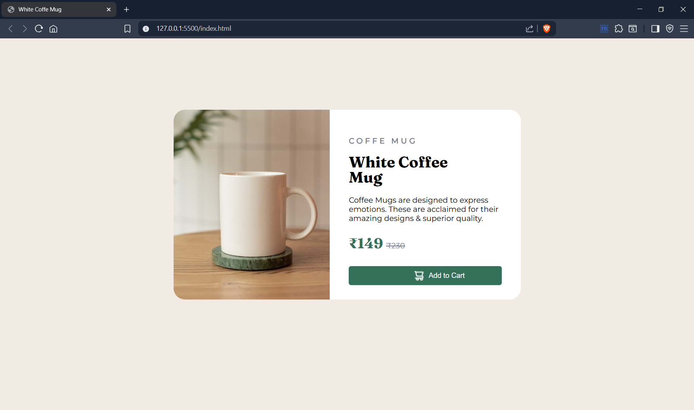

# ☕ White Coffee Mug - Product Card UI

A clean and minimal product card UI built with **HTML** and **CSS** only.

## 🚀 Live Demo
[View it live here](https://hunnybunny14.github.io/coffee-mug)

## 📦 Features
- Clean Flexbox layout
- Google Fonts integration (`Fraunces`, `Montserrat`)
- Add to Cart button with hover animation
- Modern product card styling

## 🧠 Tech Used
- HTML5
- CSS3

## 📌 Note
This version is **not responsive** — optimized for desktop view only.

---

### 📸 Preview

---

### ✍️ Author

**Hunny Dhingia**  
B.Tech CSE (AI & ML)  
Graphic Era Dehradun (2024–2028)

---

> ⭐ If you liked this, give it a star on GitHub!
